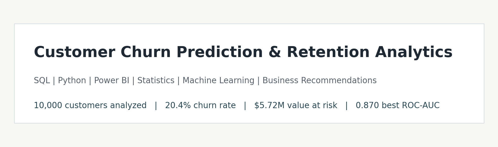
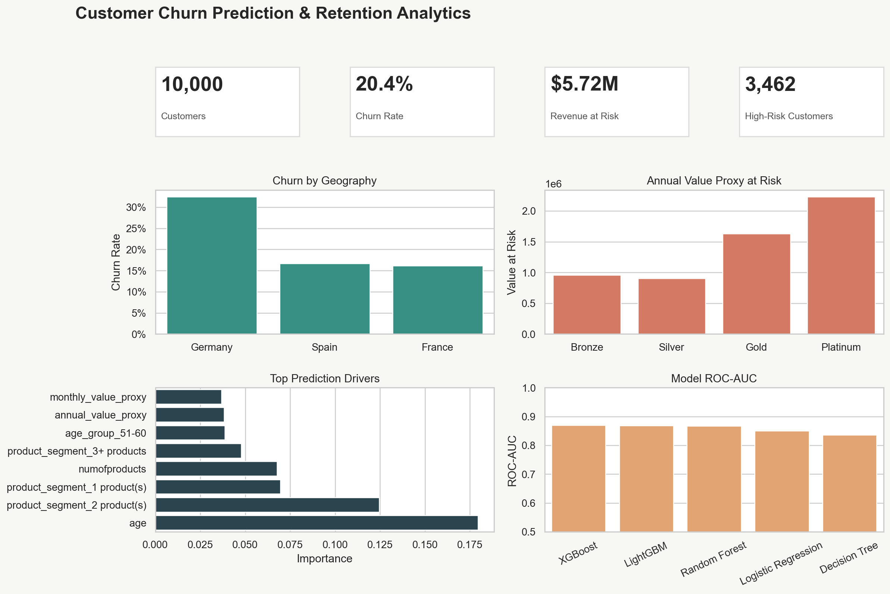
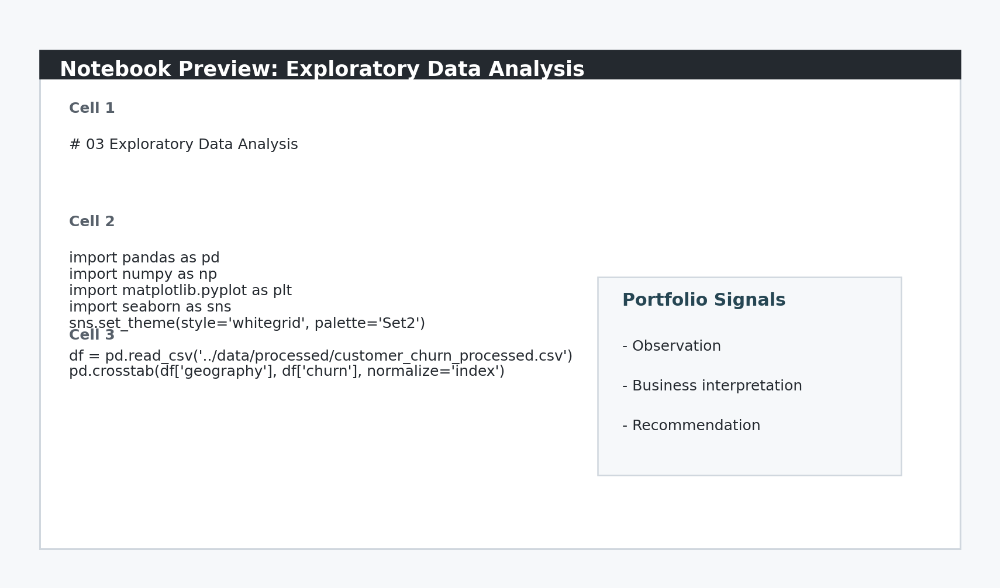
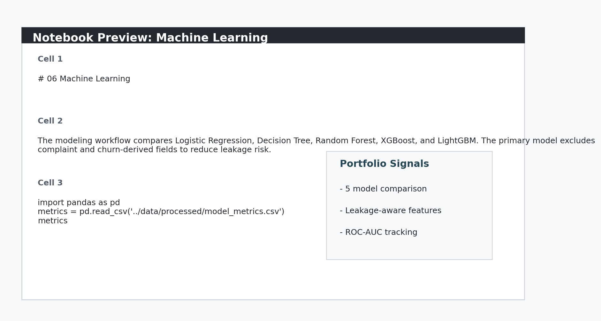

# Customer Churn Prediction & Retention Analytics



An end-to-end business analytics portfolio project focused on identifying churn drivers, predicting customer attrition, quantifying value at risk, and translating analysis into retention recommendations.

## Project Overview

This project follows a consulting-style analytics flow:

```text
Data -> Analysis -> Insight -> Business Recommendation
```

The work is intentionally notebook-centric and business-oriented. It demonstrates SQL, Python, statistics, machine learning, Power BI dashboard planning, executive communication, and resume-ready storytelling.

## Business Problem

Customer churn reduces recurring value and increases acquisition pressure. The objective is to help a banking business:

- Identify customers likely to churn.
- Understand the key drivers behind churn.
- Quantify annual value at risk.
- Segment high-risk and high-value customers.
- Recommend targeted retention actions.

## Dataset Description

- Dataset selected: [Bank Customer Churn](https://www.kaggle.com/datasets/radheshyamkollipara/bank-customer-churn)
- Reproducible CSV mirror used: [GitHub dataset mirror](https://github.com/Lawal-faruq/Customer-Churn-Analysis)
- Rows analyzed: 10,000 customers
- Raw fields: 18
- Final processed fields: 34
- Target variable: `Exited`, standardized as `churn`

The dataset includes customer demographics, geography, tenure, account balance, number of products, activity status, estimated salary, complaint behavior, satisfaction score, card type, loyalty points, and churn label.

## Repository Structure

```text
Customer-Churn-Analytics/
|-- data/
|   |-- raw/
|   |-- processed/
|-- notebooks/
|   |-- 01_data_understanding.ipynb
|   |-- 02_data_cleaning.ipynb
|   |-- 03_eda.ipynb
|   |-- 04_sql_analysis.ipynb
|   |-- 05_statistical_analysis.ipynb
|   |-- 06_machine_learning.ipynb
|-- sql/
|   |-- schema.sql
|   |-- churn_analysis_queries.sql
|-- powerbi/
|   |-- Dashboard_Build_Guide.md
|   |-- customer_churn_powerbi_data.csv
|   |-- powerbi_model_measures.dax
|-- reports/
|   |-- Executive_Summary.pdf
|-- images/
|-- FINAL_DELIVERABLES.md
|-- PROJECT_SOURCES.md
|-- requirements.txt
|-- README.md
```

## Methodology

1. Data understanding: data overview, missing values, duplicates, churn distribution, and class imbalance.
2. Data cleaning: standardized field names, validation checks, encoding-ready fields, and feature engineering.
3. Feature engineering: age group, tenure group, customer value segment, monthly value proxy, customer lifetime value, revenue at risk, and high-risk flag.
4. SQL analysis: churn rate, revenue loss, product-wise churn, geography-wise churn, customer lifetime value, and high-risk customer identification.
5. EDA: churn visuals, revenue charts, segmentation analysis, correlation matrix, and business interpretation.
6. Statistical analysis: t-tests and chi-square tests for tenure, value, age, geography, gender, and age groups.
7. Machine learning: Logistic Regression, Decision Tree, Random Forest, XGBoost, and LightGBM.
8. Dashboarding: Power BI-ready dataset, DAX measures, dashboard blueprint, and screenshots.
9. Executive communication: recruiter-friendly PDF summary and resume bullets.

## Key Findings

- Overall churn is 20.4%, representing 2,038 churned customers out of 10,000.
- Germany has the highest geography-level churn rate at 32.4%.
- The 51-60 age group has the highest age-group churn rate at 56.2%.
- The Platinum segment contributes the highest annual value proxy at risk: $2,229,843.
- The full annual value proxy at risk is $5,724,781.
- The strongest model driver is age, followed by product segment and customer value fields.
- Inactive customers and low-satisfaction customers show materially higher churn risk.
- Cross-sell alone is not enough; customers with multiple products can still churn.
- Loyalty points and card type provide useful segmentation for retention offer design.
- High-risk customers should be ranked by churn risk and customer lifetime value, not churn probability alone.

## Model Performance

| Model | Accuracy | Precision | Recall | F1 Score | ROC-AUC |
|---|---:|---:|---:|---:|---:|
| XGBoost | 0.870 | 0.826 | 0.458 | 0.589 | 0.870 |
| LightGBM | 0.823 | 0.551 | 0.697 | 0.616 | 0.868 |
| Random Forest | 0.830 | 0.564 | 0.721 | 0.633 | 0.867 |
| Logistic Regression | 0.773 | 0.464 | 0.747 | 0.572 | 0.851 |
| Decision Tree | 0.784 | 0.479 | 0.725 | 0.577 | 0.836 |

Best model by ROC-AUC: XGBoost at 0.870.

The tuned Random Forest also achieved ROC-AUC of 0.868 and is useful as an explainable campaign-prioritization model.

## Dashboard Screenshots



Additional assets:

- `images/churn_by_age_group.png`
- `images/churn_by_geography_gender.png`
- `images/revenue_at_risk_by_segment.png`
- `images/feature_importance.png`
- `images/model_comparison.png`
- `images/roc_curve.png`

Power BI Desktop was not available in the build environment, so the project includes:

- `powerbi/customer_churn_powerbi_data.csv`
- `powerbi/powerbi_model_measures.dax`
- `powerbi/Dashboard_Build_Guide.md`

These files are ready to recreate the `.pbix` dashboard manually in Power BI Desktop.

## Notebook Previews





## Business Recommendations

- Launch a save campaign for high-risk, high-value customers before renewal or inactivity thresholds are reached.
- Investigate geography-specific churn drivers in Germany through service quality and product-fit analysis.
- Create age-aware retention journeys for middle-aged and older customers with complex financial needs.
- Use satisfaction and complaint signals as immediate escalation triggers for relationship managers.
- Prioritize Platinum and Gold customer segments when allocating retention budgets.
- Bundle loyalty benefits with card-type offers for customers with declining engagement.
- Track revenue at risk weekly so retention teams focus on value preservation, not only churn count.
- Refresh churn predictions monthly and route the top-risk decile into targeted outreach.
- Monitor model performance and recalibrate thresholds if churn mix changes by geography or product segment.
- Pair predictive scores with business rules so recommendations remain explainable to non-technical stakeholders.

## Resume Highlights

- Analyzed 10,000 customer records using SQL and Python to identify churn drivers across demographics, geography, tenure, product usage, satisfaction, and customer value segments.
- Built and compared Logistic Regression, Decision Tree, Random Forest, XGBoost, and LightGBM models to predict churn, with XGBoost achieving 0.870 ROC-AUC.
- Designed Power BI-ready dashboard assets tracking churn rate, customer lifetime value, revenue at risk, high-risk customers, and retention opportunities.
- Generated retention recommendations by identifying high-value churn segments, key attrition factors, and $5.72M in annual value proxy at risk.

## How To Run

Install dependencies:

```bash
pip install -r requirements.txt
```

Run the notebooks from the repository root in this order:

```text
01_data_understanding.ipynb
02_data_cleaning.ipynb
03_eda.ipynb
04_sql_analysis.ipynb
05_statistical_analysis.ipynb
06_machine_learning.ipynb
```

To recreate the Power BI dashboard, open Power BI Desktop and follow `powerbi/Dashboard_Build_Guide.md`.

## Future Improvements

- Add SHAP explainability for model-level and customer-level churn explanations.
- Replace value proxy assumptions with actual revenue data if available.
- Add campaign simulation to estimate retention ROI under different offer-cost scenarios.
- Build cohort-based churn tracking by acquisition month if historical transaction data becomes available.
- Add fairness and bias checks across geography, age group, and gender segments.
