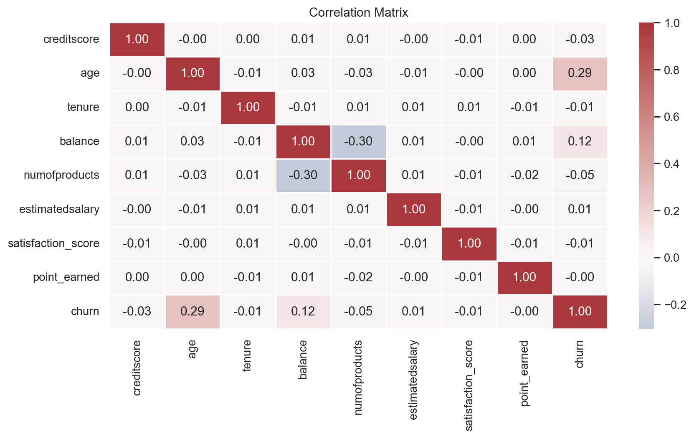
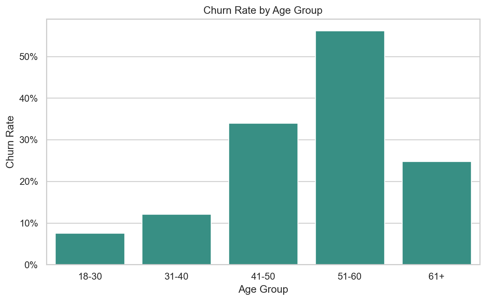
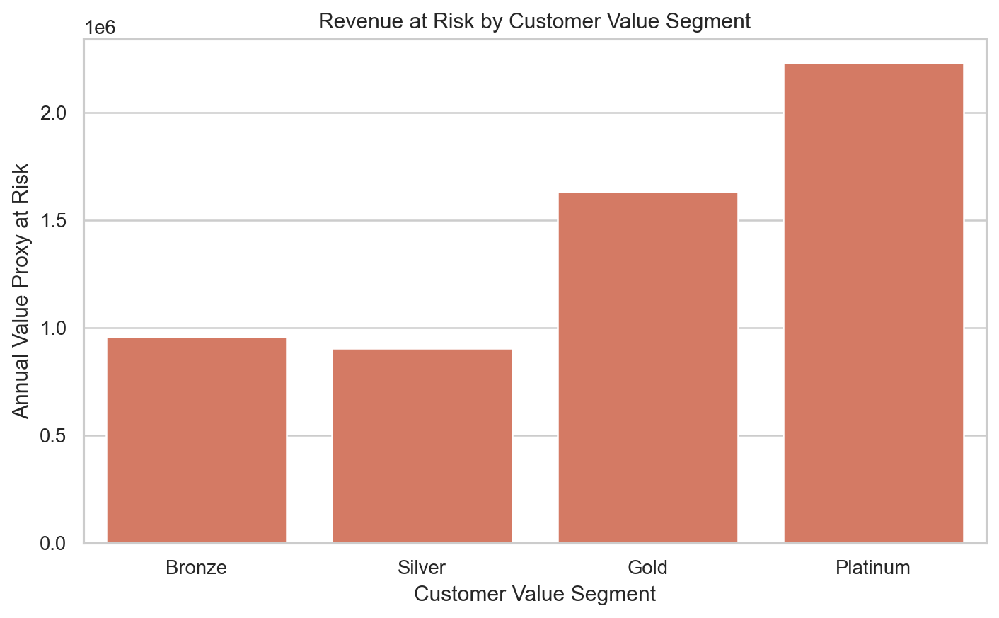
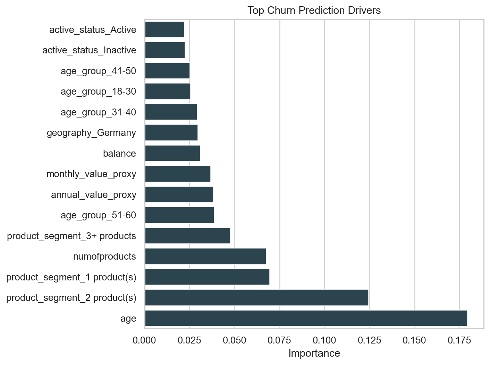
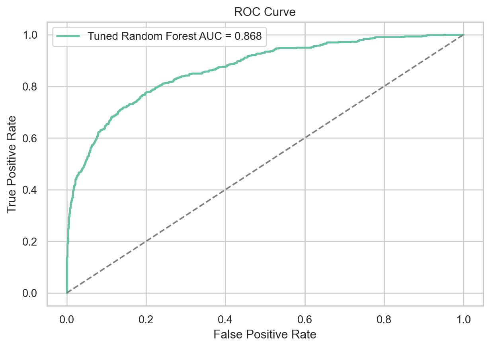

# Customer Churn Prediction & Retention Analytics

## Customer Analytics | Predictive Analytics | Business Intelligence

Portfolio project for Business Analytics, Analytics Consulting, Customer Analytics, and Data Analytics roles.

---

**Research Question:**  
How can customer behavior and business data be used to predict customer churn and generate actionable retention strategies?

**Core Narrative:**  
**Data → Analysis → Insight → Business Recommendation**

**Data Source:**  
Bank Customer Churn Dataset containing **10,000 customer records** with demographic, behavioral, product usage, financial, and customer satisfaction attributes. The target variable **Exited** is standardized as **Customer Churn** for predictive and business analysis.

---

# 1. Problem Statement

Customer churn is one of the most critical business challenges for customer-centric organizations, directly impacting recurring revenue, customer lifetime value, and long-term profitability. Since acquiring new customers is significantly more expensive than retaining existing ones, organizations require a structured analytics framework to identify customers at risk of leaving and design targeted retention strategies.

This project develops an end-to-end customer churn analytics framework that combines business analytics, statistical analysis, SQL, machine learning, and data visualization to understand customer behavior, identify churn drivers, predict future churn, and generate actionable business recommendations.

**Business Objective:** Identify high-risk customer segments, understand the key factors influencing customer attrition, estimate business value at risk, and recommend data-driven customer retention strategies.

---

# 2. Business Context

The analysis is designed from a **Business Analytics and Analytics Consulting** perspective rather than purely as a machine learning exercise.

The project addresses questions such as:

- Which customer segments exhibit the highest churn risk?
- Which demographic and behavioral factors influence customer attrition?
- How do tenure, product usage, and customer engagement affect churn?
- Which customers should be prioritized for retention campaigns?
- How can predictive analytics support proactive customer retention?

The notebook emphasizes explainable analytics by combining SQL-based business analysis, exploratory data analysis, statistical reasoning, predictive modelling, and business recommendations.

---

# 3. Project Snapshot

| Item | Details |
|------|---------|
| **Industry** | Retail Banking |
| **Dataset** | Bank Customer Churn Dataset |
| **Records Analysed** | 10,000 Customers |
| **Target Variable** | Customer Churn (Exited) |
| **Primary Objective** | Predict Customer Churn & Improve Retention |
| **Business Focus** | Customer Analytics, Predictive Analytics & Business Intelligence |

---

# 4. Analytical Methodology

The project follows a structured Business Analytics workflow:

- Data Understanding
- Data Cleaning & Feature Engineering
- SQL Business Analysis
- Exploratory Data Analysis (EDA)
- Statistical Analysis
- Predictive Modelling
- Business Insights
- Business Recommendations

---

# 5. Key Business Insights

- Overall customer churn rate is **20.4%**, representing **2,038 churned customers** out of 10,000 customers.
- Germany exhibits the highest customer churn rate (**32.4%**) among all geographic regions.
- Customers aged **51–60 years** demonstrate the highest churn propensity.
- Platinum customers contribute the highest annual revenue at risk, highlighting the importance of prioritizing premium customer retention.
- Estimated annual business value at risk exceeds **$5.72 Million**.
- Customer age, satisfaction, complaints, activity status, and product ownership emerge as the strongest business indicators influencing churn.
- High-value customers should be prioritized based on both churn probability and customer lifetime value rather than churn probability alone.

---

# 6. Business Value

This project demonstrates how customer analytics can help organizations:

- Identify customers likely to churn before attrition occurs.
- Prioritize retention campaigns using customer lifetime value and churn probability.
- Quantify revenue at risk across customer segments.
- Improve customer segmentation and marketing effectiveness.
- Support data-driven business decisions through predictive analytics.

---

# 7. Key Analytical Insights

## Correlation Analysis

Understanding relationships between customer attributes and churn-related variables.



---

## Customer Segmentation Analysis

Customer churn distribution across different customer segments to identify high-risk groups.



---

## Revenue at Risk Analysis

Estimated annual revenue exposure across customer value segments.



---

## Feature Importance

Key business variables driving customer churn identified through machine learning.



---

## Predictive Model Performance

Performance comparison of machine learning models using ROC analysis.



---

# 8. Predictive Modelling

Five supervised learning models were developed and evaluated for customer churn prediction:

- Logistic Regression
- Decision Tree
- Random Forest
- XGBoost
- LightGBM

### Best Performing Model

**XGBoost**

- ROC-AUC : **0.870**
- Accuracy : **87.0%**

The model successfully identifies high-risk customers while providing an effective balance between predictive performance and business applicability.

---

# 9. Business Recommendations

- Prioritize proactive retention campaigns for high-value customers exhibiting elevated churn risk.
- Use customer satisfaction and complaint history as early warning indicators.
- Design targeted engagement programs for customers aged **51–60 years**.
- Allocate retention budgets based on both customer lifetime value and churn probability.
- Continuously monitor customer churn trends through predictive analytics.
- Refresh predictive models periodically to adapt to changing customer behaviour.

---

# 10. Repository Structure

```text
Customer-Churn-Analytics/
│
├── data/
│   ├── raw/
│   └── processed/
│
├── notebook/
│   └── Customer_Churn_Analytics.ipynb
│
├── sql/
│   ├── schema.sql
│   └── churn_analysis_queries.sql
│
├── images/
│
├── reports/
│   └── Executive_Summary.pdf
│
├── LICENSE
├── README.md
├── requirements.txt
└── .gitignore
```

---

# 11. Tech Stack

**Python • SQL • Pandas • NumPy • Matplotlib • Seaborn • Scikit-learn • XGBoost • LightGBM • Power BI**

---

# 12. Skills Demonstrated

- Business Analytics
- Customer Analytics
- SQL Analytics
- Exploratory Data Analysis (EDA)
- Statistical Analysis
- Predictive Modelling
- Machine Learning
- Customer Segmentation
- Business Intelligence
- Data Storytelling

---

# 13. How to Run

Install the required dependencies:

```bash
pip install -r requirements.txt
```

Launch the notebook:

```bash
jupyter notebook notebook/Customer_Churn_Analytics.ipynb
```

Run all notebook cells sequentially from top to bottom.

---

# 14. License

This project is licensed under the **MIT License**. See the [LICENSE](LICENSE) file for more information.

---

# 15. Disclaimer

This project has been developed for educational and portfolio purposes to demonstrate Business Analytics, Customer Analytics, Predictive Analytics, and Machine Learning techniques. The dataset used is publicly available, and the analysis, findings, and recommendations are intended solely for learning and demonstration purposes.